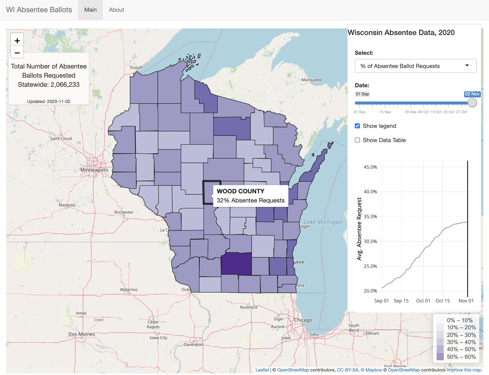

# WI Absentee Ballots

*************************************************

This project is to help Wisconsinites, activists, and election-analysts examine and track Wisconsin absentee ballot data for the 2020 Presidential Election.

With more people than ever casting a ballot via mail this year due to Covid-19, I wanted to visually track the number of absentee ballot requests from September 1st (the first-day data on absentee ballots became available) up until Election Day in every Wisconsin county. 

Users can see day-by-day in each county the proportion of registered voters that have requested an absentee ballot, the proportion of requested ballots that have been sent back to voters, and also the proportion of those absentee ballots that have been received by election officials and cased to vote. Additionally, this project allows users to analyze voter registration and estimated voting-eligible population data by county.

I was inspired to create this project as part of the MapBox [Elections Mapping Challenge](https://www.mapbox.com/elections-challenge-2020). I plan to continue expanding this project, to include absentee ballot data from past election cycles, update it to track data for future election cycles, include additional metrics and functions, and potentially expand to more states and records of voting modes.

 

Stay safe, and happy voting!

 

**Data Sources:** [Wisconsin Elections Commission](https://elections.wi.gov/) and the [American Community Survey](https://www.census.gov/programs-surveys/acs)

**Project link:** [https://kka2120.shinyapps.io/wi_absentee/](https://kka2120.shinyapps.io/wi_absentee/)

 

